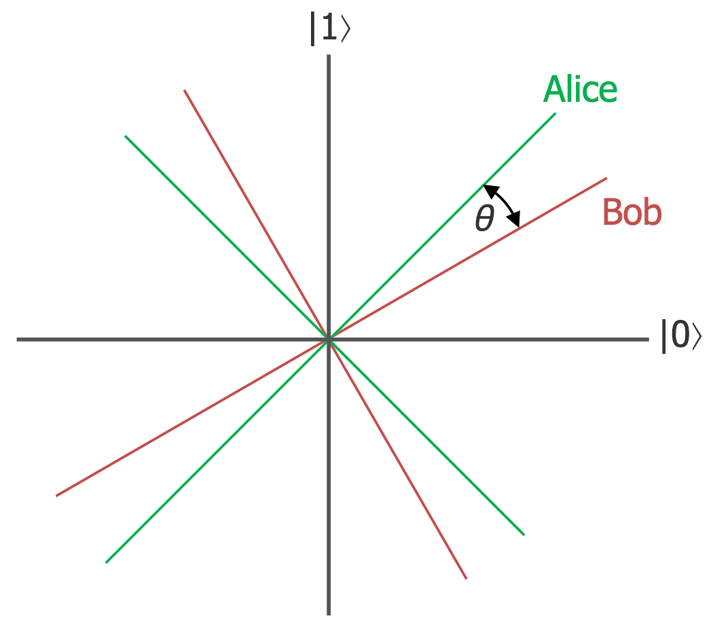

# 2-qubit-simulator
This is a small simulator for two-qubit systems.

## Features
### Quantum gates
* Define arbitrary 1-qubit or 2-qubit quantum gates.
* Create superpositions and entangled states by applying a sequence of gates.

### Measurements
* Make partial measurements on 2-qubit systems in arbitrary bases.

## Example: Simulate the CHSH experiment
Run `python3 simulator.py` to execute the experiment.
### The CHSH experiment
#### Setup
Alice and Bob are playing a cooperative game. They each receive one classical
bit and one qubit. The qubits are known to be correlated, such that they will
always give the same result. If the two classical bits are both `1`, alice
and Bob want to output different results. Otherwise, they want to output
the same result. Alice and Bob may devise a strategy in advance, but they are
not allowed to communicate during the experiment.

#### The classical case assumes locality
In a classical universe, the state of the two qubits are completely defined,
even if Alice and Bob can't tell what those states are. If this assumption is
true, then nothing Alice does can affect the outcome of Bob's measurement, and
_vice versa_.

The best strategy is for Alice and Bob to both always output `0`. In this way,
they can target 3 out of 4 possible configurations of their classical bits.
They can therefore expect to win the game with 0.75 probability:

| Alice | Bob | Desired Result |
|-------|-----|----------------|
| 0     | 0   | Same           |
| 0     | 1   | Same           |
| 1     | 0   | Same           |
| 1     | 1   | Different      |

#### The quantum case assumes non-locality
In a quantum universe, information about the individual qubits are distributed
through the 2-qubit system. In particular, a partial measurement of the system 
(i.e. a measurement on one of the qubits) affects the state of the entire
system (i.e. both the measured and unmeasured qubits). If this assumption is
true, Alice and Bob can devise a strategy to increase their chances of winning.
Their best strategy is to align their measurements, such that the angle between
their respective bases is known:

| Alice | Bob | Alice's basis rotation | Bob's basis rotation | Angle between bases | Probability of Same Result          |
|-------|-----|------------------------|----------------------|---------------------|-------------------------------------|
| $0$     | $$0$$   |                     |                 |               |  |
| 0     | 1   |                     |                |                |   |
| 1     | 0   |                   |                 |               |  |
| 1     | 1   |                   |                |               |  |
